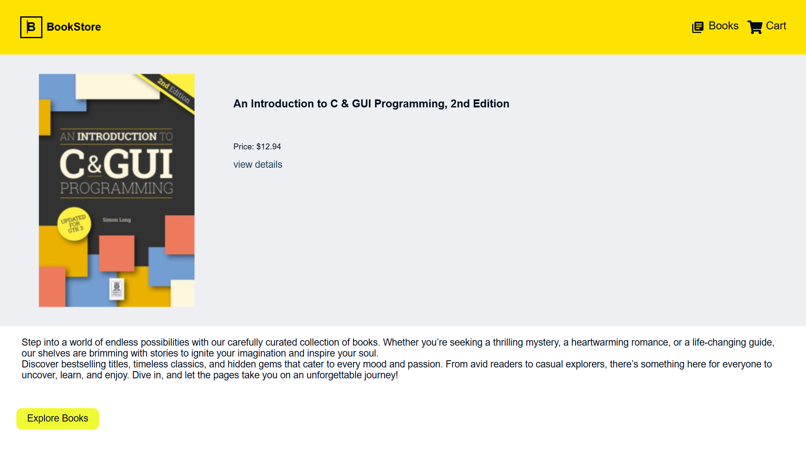

 📚 Bookstore Web Application

🌟 Overview

The Bookstore Web Application is a fully responsive online bookstore where users can browse books, filter them based on price, view book details, add items to the cart, and proceed to checkout. The project is currently under development, with authentication features planned for future updates.

🚀 Features

### 🏠 Home Page

#### 🏠 Home Page Features:
- **Carousel of books**  
- **Static header** with navigation options for `Books` and `Cart`  
- **"Explore Books" button** redirects users to the `Books List`

### 📖 Books List Page

#### 📖 Books List Page Features:

- Displays available books with a **search bar** and **price range filter**  
- **Responsive Design:**  
  - On larger screens, the filter appears on the **left panel**  
  - On mobile, a **filter button** opens a pop-up with filter options  
- Clicking a book redirects users to the **Book Details Page**  

### 📘 Book Details Page

#### 📖 Book Details Page Features:
- Displays **book title, author, specifications, and quantity selector**  
- **Add to Cart functionality** ✅ (Fully functional)  
- **Responsive Design:**  
  - On **larger screens**, the layout remains structured with book details and actions side by side  
  - On **mobile screens**, the **"Add to Cart" and "Buy Now"** buttons are positioned at the bottom for easy access  
- **Upcoming Features:**  
  - `"Buy Now"` button (Planned for future updates)  
  - `"Check Pincode"` feature (Planned for future updates)  

### 🛒 Cart Page

#### 🛒 Cart Page Features:
- Shows **list of added books** with **quantity, price, and delete option**  
- Displays an **order summary** with a `"Proceed to Checkout"` button redirectes to checkout page.
- **Responsive Design:**  
  - On **larger screens**, book details and order summary appear **side by side**  
  - On **mobile screens**, book details are **stacked vertically** for better readability  

### 🏷️ Checkout Page

#### 🏷️ Checkout Page Features:
- **Personal Details Form, Shipping Method, and Payment Method**  
- **Order Summary:**  
  - On **desktop view**, the order summary appears on the **right side**  
  - On **mobile view**, order details are **collapsed under a `"Show Item Details"` button** for better accessibility  
- **Upcoming Feature:**  
  - `"Discount/Gift"` option (Planned but not yet implemented)  

🛠 Technologies Used

## 🚀 Technologies Used:

| Technology         | Description  |
|--------------------|-------------|
| ⚛️ **React.js**   | Frontend development |
| 🎨 **CSS & Styled Components** | Styling (`WantedStyle.js` for additional styles in the header) |
| 📜 **JavaScript**  | Data handling and dynamic filtering |
| 🌐 **React Router** | Seamless navigation |

## 🔮 Future Improvements:
1️⃣ **Implement user authentication** (Login/Signup) 🔑  
2️⃣ **Improve checkout flow** with payment integration 💳  
3️⃣ **Enhance responsiveness** of the book details page 📱  
4️⃣ **Add a backend** for order management & authentication 🖥️  

## 🏗 How to Run the Project

1. **Clone the repository**  
   `git clone https://github.com/mohanreddytm/book-store`  

2. **Navigate into the project folder**  
   `cd book-store`  

3. **Install dependencies**  
   `npm install`  

4. **Start the project**  
   `npm start`  

5. **Open in browser** at [http://localhost:3000/](http://localhost:3000/) 🚀  
